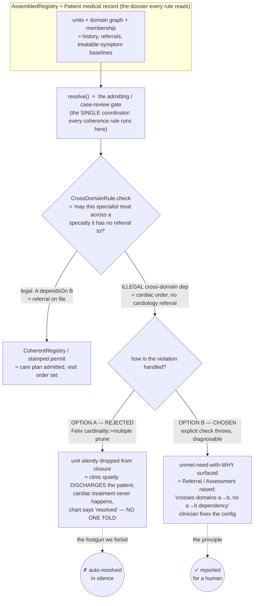
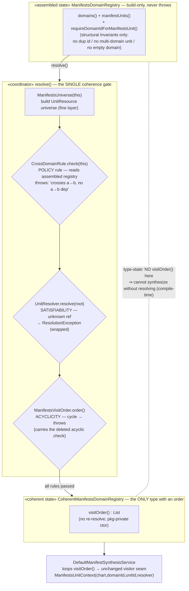
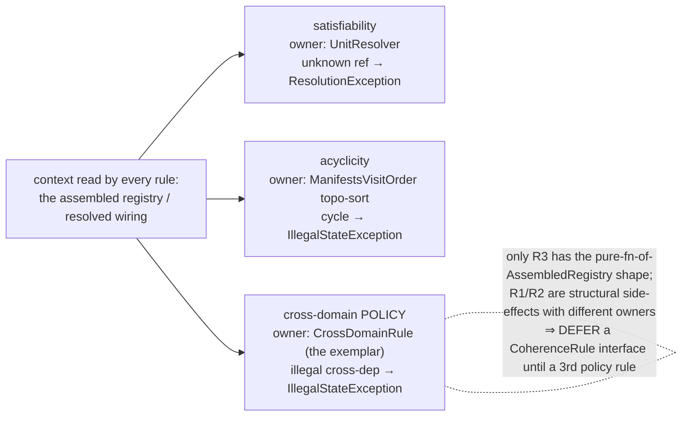

Settled during step-1 walker-retirement (manifests resolver, branch
`design/step1-walker-retirement-spec`). See [[docrepo-dag-state]] STEP 1 section.

## The decision

The **cross-domain rule** (a unit in domain A may depend on a unit in domain B only
if A transitively dependsOn B) is enforced by **option B**: an explicit, pure check
`CrossDomainRule.check(AssembledRegistry)` that **throws a diagnosable error**, invoked
by `resolve()` (NOT by the constructor). We rejected **option A** (encode the rule into
the universe so an illegal cross-domain `require` becomes unsatisfiable).

## Why option A was rejected (the concern — verified empirically by TDD, not guessed)

Option A does **not** throw. Because each unit enters the closure only via its domain's
`requireAll(NS_UNIT,"(domain=id)")` containment, which carries `cardinality:=multiple`,
Felix **silently prunes** an offending unit from the match set when its own mandatory
`require` can't be satisfied. Observed closure for the illegal case = `{synthesis-root,
b/v, b}` — `a/u` and domain `a` just vanished, resolve "succeeded". A misconfigured
manifest unit would silently disappear from synthesis with **no error** — strictly worse
than the old walker's loud throw.

Deeper reason it can't live in the resolver at all: in the illegal case `a/u` requires
`(unit=b/v)` and **b/v genuinely exists**, so under plain filters `a/u` resolves to it
happily — the closure is *complete and coherent*. The cross-domain violation is therefore
**invisible to the resolver and to any completeness/head-count check**. The rule is a
**policy ABOVE resolution**, not derivable from it.

## The governing principle (user)

**The system must REPORT an error condition for a responsible person to fix — it must
NOT resolve/auto-correct it silently.** The silent prune was the system quietly
auto-resolving a misconfiguration; that is exactly what we forbid. [[validate-at-the-boundary]]

## The concern, in the health-system mirror (the metaphor we reasoned with)

Map the manifests case onto the shipped doctor/health system to see why the silent
prune is the unacceptable outcome (specialist↔unit, referral-policy↔cross-domain rule,
medical record↔AssembledRegistry, admitting gate↔resolve()):

Why the resolver structurally CAN'T own this rule (the non-obvious crux): in the illegal
case the dependency unit `b/v` genuinely EXISTS, so a plain `(unit=b/v)` require resolves
happily — the closure is coherent AND complete, the violation is invisible to resolution
and to any head-count. It's a **policy above resolution** (≈ the referral rule is hospital
policy, not something the scheduler can infer from the roster). Hence an explicit rule
that reports. [[specialist-as-ledger-northstar]] [[referral-roundtrip-state]]

## C4 view — the coordinator and the rule-context contract

**C4 L2/L3 (component) — who reads what, who throws, where the order is born.**
The type-state is the spine: an *assembled* registry (build-only, never throws on a
malformed graph) → `resolve()` (the coordinator, the single gate) → a *coherent*
registry (the only type carrying a visit order). Every coherence rule reads the SAME
context (the assembled registry / the resolved wiring) and REPORTS by throwing; none
auto-resolves.

**The 3 coherence checks the gate coordinates (one context, three owners — rule-of-three not yet reached):**

## The coordinator + the rule-context contract (the generalization)

Metaphor: a coherence rule is a code-compliance check run at **one permit gate**, where
every inspector is handed **the same dossier** and reads it (never re-surveys the site).

- **Coordinator = `resolve()`** — the spec's "single coherence gate", now with teeth: the
  ONE place every coherence rule runs.
- **Rule context = the `AssembledRegistry`** (the dossier): domain graph
  (`dependsOnDomainIds`) + unit graph (`dependsOnManifestsUnitIds`) + unit→domain
  membership. A coherence rule is a **pure function of the AssembledRegistry**.
  `CrossDomainRule` is the exemplar.
- **`CoherentRegistry`** = the stamped permit: proof all rules passed + carries the visit order.

The rule *family* already exists (3 checks, today scattered with different owners/shapes):
satisfiability (the resolver, unknown-ref → ResolutionException), acyclicity (the topo-sort
in `ManifestsVisitOrder`), cross-domain policy (`CrossDomainRule`).

## What we deferred and why

Only `CrossDomainRule` currently has the "pure predicate over AssembledRegistry" shape;
the other two have different shapes/owners. Per no-speculative-abstraction
([[refactor-pipeline-candidates]], CLAUDE.md "three similar lines beat a premature
helper"), we **DO NOT** introduce a `CoherenceRule` interface / rule-registry yet. We
**DEFER it to rule-of-three** — when a THIRD same-shaped *policy* rule appears, extraction
is mechanical because the context (`AssembledRegistry`) is already crystallized. For now:
name `resolve()` as the coordinator, document the "pure fn of AssembledRegistry" convention,
keep `CrossDomainRule` as one explicit step inside `resolve()`.

Task 5 wires `CrossDomainRule.check(registry)` into `resolve()` right after deleting the
old constructor `validate*`, so the rule moves constructor→resolve, stated and loud, never silent.
