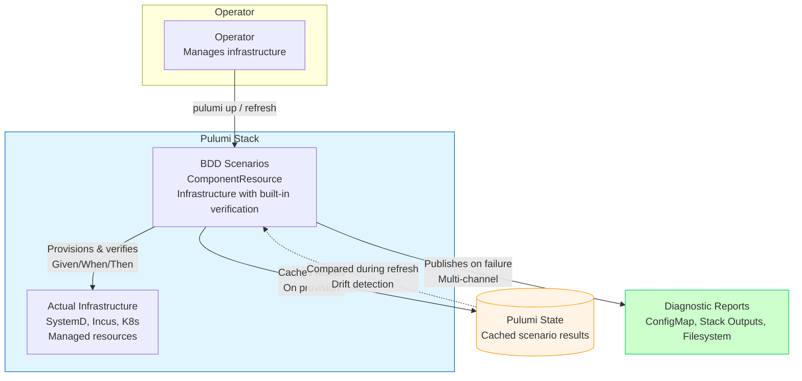
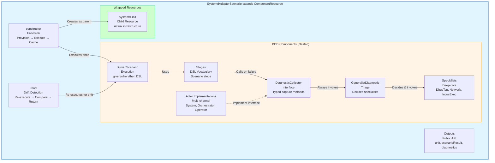
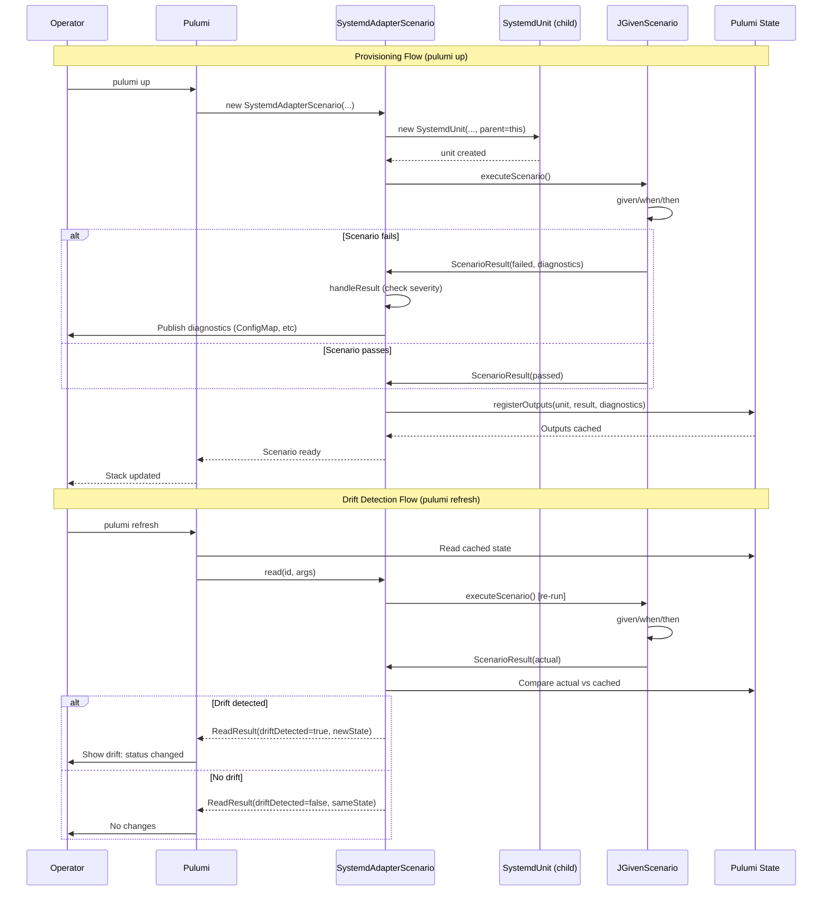

# BDD Scenarios as Pulumi Resources

**Date:** 2026-06-04
**Status:** Design revision - BDD scenarios as ComponentResource
**Author:** Claude (brainstorming session with user)

## Overview

**Fundamental insight:** BDD scenarios ARE the infrastructure, not tests OF infrastructure. Every Pulumi resource is provisioned through a BDD scenario that extends `ComponentResource`, making verification, diagnostics, and living documentation intrinsic to resource provisioning.

**First implementation:** SystemD Adapter reachability scenario that wraps the dbus-tcp systemd unit provisioning, verifies endpoint reachability, and captures diagnostics on failure.

**Current blocker:** Master provisioning fails at systemd adapter probe (port 12434 connection refused). This scenario will both document expected behavior AND provide diagnostic evidence to fix the issue.

## Goals

1. **Unblock provisioning:** Diagnose why port 12434 dbus probe fails
2. **Establish BDD pattern:** First implementation of BDD-as-ComponentResource architecture
3. **Living documentation:** Scenario IS the Pulumi resource, verification intrinsic to provisioning
4. **Actor-specific outputs:** System gets metrics, orchestrator gets decisions, operator gets troubleshooting guide
5. **Robust provisioning:** Scenarios block or allow degraded mode based on severity + operator policy
6. **Uniform abstraction:** Pulumi stack code only interacts with scenarios, not raw infrastructure resources

## Pulumi Drift Detection Integration

**IMPORTANT:** Do not implement custom drift detection. Pulumi already has built-in drift detection via `pulumi refresh`. Our scenarios integrate with Pulumi's native mechanism instead of reinventing it.

### Why Pulumi's Drift Detection?

We initially considered implementing `checkDrift()` methods on scenarios, but this would duplicate Pulumi's existing functionality. Pulumi already tracks resource state and can detect drift - we just need to hook into its lifecycle.

### Pulumi's Three States

1. **Desired state** - What your program declares (the code)
2. **Pulumi state** - What Pulumi thinks exists (stored in backend)
3. **Actual state** - What actually exists in infrastructure

### Normal Provisioning Flow

```text
pulumi up
  ↓
1. Read program → desired state
2. Compare with Pulumi state
3. Generate plan (create/update/delete)
4. Execute plan
5. Update Pulumi state to match actual
```

### Drift Detection Flow

```text
pulumi refresh  (or pulumi preview --refresh)
  ↓
1. Read Pulumi state (what we think exists)
2. Call read() on each ComponentResource to get actual state
3. Compare actual vs Pulumi state
4. Show differences (drift)
5. Update Pulumi state (refresh) OR just show it (preview)
```

### ComponentResource Lifecycle Hooks

Pulumi calls these methods on our scenario resources:

| Hook | When Called | Purpose |
| --- | --- | --- |
| `constructor()` | `pulumi up` | Provision infrastructure, execute scenario once |
| `read()` | `pulumi refresh` | Query actual state, re-execute scenario for drift detection |
| `delete()` | `pulumi destroy` | Clean up resources |

### Operator Workflow

```bash
# Normal provisioning - scenario executes once
$ pulumi up
Creating SystemdAdapterScenario "dbus-adapter"
  → Scenario executed: ✗ FAILED (port 12434 refused)
  → Severity: WARNING, continuing degraded
Resources: 1 created

# Week later, check for drift - Pulumi calls read() on scenario
$ pulumi refresh
Refreshing SystemdAdapterScenario "dbus-adapter"
  → Scenario re-executed: ✓ PASSED (socat fixed!)
  ~ scenarioResult: {
      - status: "failed"
      + status: "passed"
    }
State refreshed

# Or preview drift without updating state
$ pulumi preview --refresh
Previewing changes:
  ~ SystemdAdapterScenario "dbus-adapter"
    scenarioResult: "failed" → "passed" (drift detected)
```

**Key takeaway:** Use Pulumi's `read()` lifecycle hook for drift detection, not custom methods. This integrates with operator's existing workflow (`pulumi refresh`) instead of introducing new commands.

## Architecture

### C4 Context Diagram: BDD Scenario as Infrastructure



### C4 Component Diagram: SystemdAdapterScenario Structure



### C4 Sequence Diagram: Provisioning vs Drift Detection



### BDD Scenario as ComponentResource

**Key principle:** Scenario extends Pulumi `ComponentResource` and wraps the actual infrastructure resource.

```
SystemdAdapterScenario.java (extends ComponentResource)
├── constructor(name, args, opts)        (Pulumi resource lifecycle)
│   ├── provision wrapped resource       (SystemdUnit as child)
│   ├── execute scenario (given/when/then)
│   ├── handle result (severity + policy)
│   └── register outputs
├── instance()                           (Output<SystemdUnit>)
├── scenarioResult()                     (Output<ScenarioResult>)
├── diagnostics()                        (Output<Diagnostics>)
├── severity()                           (returns: Severity enum)
│
├── getSystemdUnitStatus()               (helper for diagnostics)
├── getJournalLogs()                     (helper for diagnostics)
│
├── interface DiagnosticCollector        (new: stage-specific typed interface)
│   ├── onDbusProbeStart(host, port)
│   ├── onDbusProbeSuccess(elapsed, status)
│   ├── onDbusProbeFailure(cause)
│   ├── requestGeneralistDiagnostic()    (returns: GeneralistDiagnostic)
│   └── publishDiagnostic(generalist, plan)
│
├── class GeneralistDiagnostic           (new: first-level triage)
│   ├── recordSymptom(name, details)
│   ├── invokeSpecialists()              (decides which specialists needed)
│   └── establishRemediationPlan()       (synthesizes findings → plan)
│
├── class DbusTcpSpecialist              (new: deep-dive on dbus-tcp)
│   ├── captureSystemdUnitStatus()
│   ├── captureJournalLogs()
│   ├── capturePortStatus()
│   └── suggestRemediation()
│
├── class NetworkSpecialist              (new: deep-dive on network)
│   ├── checkDnsResolution()
│   ├── checkRouting()
│   └── checkFirewall()
│
├── class IncusExecSpecialist            (new: deep-dive on incus-exec)
│   ├── checkInstanceState()
│   └── checkExecPath()
│
├── class SystemDiagnostics              (new: non-static inner class)
│   └── implements DiagnosticCollector   (captures metrics only)
│
├── class OrchestratorDiagnostics        (new: non-static inner class)
│   └── implements DiagnosticCollector   (captures decision data)
│
├── class OperatorDiagnostics            (new: non-static inner class)
│   └── implements DiagnosticCollector   (captures full diagnostics + remediation)
│
├── class Stages                         (new: non-static inner class)
│   ├── extends Stage<Stages>            (JGiven stage)
│   ├── systemd_adapter_probe_runs()     (DSL method)
│   └── dbus_endpoint_responds()         (DSL method)
│
├── class JGivenScenario                 (new: nested class for JGiven execution)
│   ├── extends ScenarioTest<...>        (JGiven scenario)
│   └── systemd_adapter_becomes_reachable() (scenario method)
│
└── enum Severity                        (new: scenario severity levels)
    ├── CRITICAL                         (stop provisioning on failure)
    └── WARNING                          (continue in degraded mode on failure)

### Stack Usage

Pulumi stack code only sees scenarios:

```java
// Stack.java
public class Stack {
  public Stack() {
    // 1. Provision Incus instance (via scenario) - scenario executes once
    var masterScenario = new IncusInstanceScenario("master", IncusInstanceArgs.builder()
        .image("bioskop-base")
        .build());
    
    // 2. Provision systemd adapter (via scenario, depends on instance) - scenario executes once
    var adapterScenario = new SystemdAdapterScenario("dbus-adapter", 
        SystemdAdapterArgs.builder()
            .instance(masterScenario.instance())  // Reference wrapped resource, no re-execution
            .port(12434)
            .build(),
        ComponentResourceOptions.builder()
            .dependsOn(masterScenario)  // Explicit dependency
            .build());
    
    // 3. Multiple resources reference adapter - no scenario re-execution
    var manifestA = new ManifestUnitScenario("manifest-a",
        ManifestUnitArgs.builder()
            .systemdUnit(adapterScenario.unit())  // Just a reference, no check
            .build());
    
    var manifestB = new ManifestUnitScenario("manifest-b",
        ManifestUnitArgs.builder()
            .systemdUnit(adapterScenario.unit())  // Just a reference, no check
            .build());
    
    // 4. Outputs - scenario results cached in Pulumi state
    ctx.export("masterInstance", masterScenario.instance());
    ctx.export("adapterDiagnostics", adapterScenario.diagnostics());
    ctx.export("stackStatus", adapterScenario.scenarioResult().apply(r -> 
        r.failed() ? "DEGRADED" : "HEALTHY"));
  }
}
```

**Drift detection** (Pulumi's native mechanism):

```bash
# Operator uses Pulumi's built-in refresh command
$ pulumi refresh

# Pulumi calls read() on all ComponentResources (including scenarios)
# Scenarios re-execute and return actual state
# Pulumi compares actual vs cached state and shows drift

Refreshing (dev)
  Type                                Name               Status      Info
  pulumi:pulumi:Stack                 rke2lab-dev        
  └─ rke2lab:bdd:SystemdAdapter      dbus-adapter       refreshed   2 changes
  
Resources:
    ~ 1 to refresh

Outputs:
  ~ adapterDiagnostics: {
      - status: "failed"
      + status: "passed"
    }
```

No custom drift detection logic needed - Pulumi handles it via `read()` lifecycle hook.

**Key decisions:**

- All BDD components are **nested** (impossible to forget)
- Actor implementations are **non-static** (can access production helper methods directly)
- **Uniform naming:** `DiagnosticCollector`, `SystemDiagnostics`, `OrchestratorDiagnostics`, `OperatorDiagnostics`, `Stages`, `JGivenScenario`, `Severity`
- **Doctor hierarchy:** Generalist always runs on failure → invokes Specialists → establishes RemediationPlan
- **Scenario owns severity:** Each scenario declares CRITICAL or WARNING based on domain knowledge
- **Operator policy override:** Strict mode can force all failures to CRITICAL during debugging
- **Execution happens once per provision:** During provisioning (constructor), result cached in Pulumi state
- **Resource references are free:** Other resources can reference `scenario.unit()` without re-triggering checks
- **Drift detection via Pulumi:** Implement `read()` lifecycle hook, not custom methods - integrates with `pulumi refresh`

### Scenario as ComponentResource Implementation

**Core pattern:** Constructor provisions wrapped resource, runs verification ONCE, caches result.

**IMPORTANT:** Scenario executes only:

1. **During provisioning** (constructor) - result cached in Pulumi state
2. **During drift detection** (`pulumi refresh`) - Pulumi calls `read()` lifecycle hook

Multiple resource references do NOT re-trigger scenario execution.

```java
public class SystemdAdapterScenario extends ComponentResource {
  private final SystemdUnit unit;
  private final Output<ScenarioResult> result;  // Lazy Output, computed once
  
  public SystemdAdapterScenario(String name, SystemdAdapterArgs args, ComponentResourceOptions opts) {
    super("rke2lab:bdd:SystemdAdapter", name, opts);
    
    // 1. Provision wrapped infrastructure resource
    this.unit = new SystemdUnit(name + "-unit", SystemdUnitArgs.builder()
        .instance(args.instance())
        .serviceName("rke2lab-dbus-tcp-system-bus")
        .scriptPath("/srv/host/systemd-scripts.d/rke2lab-dbus-tcp-system-bus.sh")
        .port(args.port())
        .build(),
        ComponentResourceOptions.builder()
            .parent(this)  // Scenario is parent
            .build());
    
    // 2. Execute BDD scenario ONCE (given/when/then via JGiven)
    //    Pulumi caches this result in state
    final ScenarioResult executionResult = executeScenario(args);
    this.result = Output.of(executionResult);
    
    // 3. Handle result based on severity + operator policy
    handleScenarioResult(executionResult);
    
    // 4. Publish diagnostics if failed (ConfigMap, stack outputs, filesystem)
    if (executionResult.failed()) {
      publishDiagnostics(executionResult);
    }
    
    // 5. Register Pulumi outputs (cached, not re-computed on reference)
    registerOutputs(Map.of(
        "unit", unit,
        "scenarioResult", result,
        "diagnostics", Output.of(executionResult.diagnostics()),
        "status", Output.of(executionResult.status())));
  }
  
  // Other resources reference this - NO scenario re-execution
  public Output<SystemdUnit> unit() {
    return Output.of(unit);
  }
  
  // Outputs for orchestrator/operator - read from cache
  public Output<ScenarioResult> scenarioResult() {
    return result;
  }
  
  public Output<Diagnostics> diagnostics() {
    return result.apply(ScenarioResult::diagnostics);
  }
  
  // Pulumi lifecycle hook - called during "pulumi refresh" for drift detection
  @Override
  protected CompletableFuture<ReadResult> read(String id, ReadArgs args) {
    // Pulumi calls this to get ACTUAL current state
    
    // 1. Re-execute scenario against live infrastructure
    final ScenarioResult currentResult = executeScenario(argsFromState(args));
    
    // 2. Get cached result from Pulumi state
    final Map<String, Object> stateProps = args.state();
    final ScenarioResult cachedResult = (ScenarioResult) stateProps.get("scenarioResult");
    
    // 3. Detect drift (status changed)
    final boolean drifted = !currentResult.status().equals(cachedResult.status());
    
    // 4. Return actual state to Pulumi (Pulumi will compare and show drift)
    return CompletableFuture.completedFuture(ReadResult.builder()
        .id(id)
        .props(Map.of(
            "unit", unit,
            "scenarioResult", currentResult,  // ← New actual state
            "diagnostics", currentResult.diagnostics(),
            "status", currentResult.status(),
            "driftDetected", drifted,
            "lastChecked", Instant.now()))
        .build());
  }
  
  private SystemdAdapterArgs argsFromState(ReadArgs args) {
    // Reconstruct args from Pulumi state for re-execution
    final Map<String, Object> props = args.state();
    return SystemdAdapterArgs.builder()
        .instance((Instance) props.get("instance"))
        .port((Integer) props.get("port"))
        .build();
  }
  
  public Severity severity() {
    return Severity.WARNING;  // Adapter failure allows degraded mode
  }
  
  private ScenarioResult executeScenario(SystemdAdapterArgs args) {
    // Run JGiven scenario programmatically
    final JGivenScenario scenario = new JGivenScenario();
    return scenario.given().incus_instance_exists(args.instance())
        .when().systemd_adapter_probe_runs(args.port())
        .then().dbus_endpoint_responds()
        .execute();
  }
  
  private void handleScenarioResult(ScenarioResult result) {
    final Severity effectiveSeverity = policy.isStrictMode() 
        ? Severity.CRITICAL 
        : severity();
    
    if (result.failed() && effectiveSeverity == Severity.CRITICAL) {
      throw new ResourceException("Scenario failed: " + result.name());
    }
    
    if (result.failed() && effectiveSeverity == Severity.WARNING) {
      log.warn("Continuing in degraded mode: {}", result.name());
    }
  }
  
  // Nested BDD components (DiagnosticCollector, Generalist, Specialists, etc.)
  // ... (same structure as before, now inside ComponentResource)
}
```

**Migration impact:** Existing provisioning code that directly creates Pulumi resources must be refactored to use scenarios. Example:

```java
// OLD: Direct resource creation + manual checks
final Instance master = new Instance("master", instanceArgs);
final SystemdUnit dbusUnit = new SystemdUnit("dbus-tcp", unitArgs);
// Probe called multiple times by different consumers - wasteful
checkSystemdReachable(dbusUnit);  // Consumer A checks
checkSystemdReachable(dbusUnit);  // Consumer B checks
checkSystemdReachable(dbusUnit);  // Consumer C checks

// NEW: Scenario-based provisioning - check once, reference many
final IncusInstanceScenario masterScenario = new IncusInstanceScenario("master", instanceArgs);
final SystemdAdapterScenario adapterScenario = new SystemdAdapterScenario("dbus-adapter",
    SystemdAdapterArgs.builder()
        .instance(masterScenario.instance())  // Access wrapped resource
        .build());  // Scenario executes ONCE here

// All consumers just reference - no re-execution
final ManifestA a = new ManifestA(adapterScenario.unit());  // Free reference
final ManifestB b = new ManifestB(adapterScenario.unit());  // Free reference
final ManifestC c = new ManifestC(adapterScenario.unit());  // Free reference

// Drift check is explicit, outside provisioning
final Output<ScenarioResult> drift = adapterScenario.checkDrift();  // Operator-triggered
```

## Implementation Scope

### Phase 1: Foundation (this spec)

**Maven dependencies:**
- Add JGiven 1.3.1 to BOM (scope: `compile`, not `test`)
- Add JUnit Jupiter API to seed-master (scope: `compile`)
- Add Pulumi Java SDK (already present) - scenarios extend `ComponentResource`
- **NO maven plugin needed** - scenarios run programmatically during pulumi up, not via `mvn test`

**New scenario resource:**
- `SystemdAdapterScenario extends ComponentResource`
- Constructor: provision → verify → handle result → register outputs
- Wraps `SystemdUnit` as child resource
- Exposes: `unit()`, `scenarioResult()`, `diagnostics()`
- Declares `severity()` = WARNING

**BDD nested components** (inside SystemdAdapterScenario):
- `DiagnosticCollector` interface (typed to dbus/systemd domain)
- `GeneralistDiagnostic` (first-level triage, decides specialist referrals)
- `DbusTcpSpecialist`, `NetworkSpecialist`, `IncusExecSpecialist` (deep-dive diagnostics)
- `SystemDiagnostics`, `OrchestratorDiagnostics`, `OperatorDiagnostics` (actor implementations)
- `Stages` (JGiven DSL vocabulary)
- `JGivenScenario` (JGiven execution, given/when/then)
- `Severity` enum (CRITICAL, WARNING)

**Production helpers:**
- `getSystemdUnitStatus(String unitName)`
- `getJournalLogs(String unitName)`
- `checkPortListening(int port)`
- `argsFromState(ReadArgs)` - reconstruct args from Pulumi state for drift detection

**Pulumi lifecycle integration:**

- `read(String id, ReadArgs args)` - re-execute scenario during `pulumi refresh`
- Compare actual state vs cached state, return drift to Pulumi

**Stack refactoring:**
- Replace direct `SystemdUnit` instantiation with `SystemdAdapterScenario`
- Update dependent resources to reference `scenario.unit()` instead of raw resource
- Pulumi dependency graph: `masterScenario` → `adapterScenario` → downstream resources

**Report publication:**
- ConfigMap (YAML metrics for system)
- Stack outputs (JSON decisions for orchestrator)
- Filesystem via pulumi-command (AsciiDoc troubleshooting for operator)

**Shared report utilities:**
- `SharedMetricsCollector` (YAML output for system)
- `SharedDecisionLog` (JSON output for orchestrator)
- `SharedReportBuilder` (AsciiDoc output for operator)

### Phase 2: Additional Scenarios (future)

Wrap more resources in scenarios following the same ComponentResource pattern:

- `IncusInstanceScenario` - wraps Incus Instance provisioning
- `ManifestUnitsScenario` - wraps manifest application
- `RKE2ServerScenario` - wraps RKE2 server installation
- `KubernetesApiScenario` - wraps Kubernetes API readiness

Each follows the same structure:

```java
public class XxxScenario extends ComponentResource {
  private final XxxResource resource;
  private final ScenarioResult result;
  
  public XxxScenario(String name, XxxArgs args, ComponentResourceOptions opts) {
    super("rke2lab:bdd:Xxx", name, opts);
    this.resource = new XxxResource(..., ComponentResourceOptions.builder().parent(this).build());
    this.result = executeScenario(args);
    handleScenarioResult(result);
    registerOutputs(...);
  }
  
  public Output<XxxResource> resource() { return Output.of(resource); }
  public Severity severity() { return CRITICAL; }  // or WARNING
}
```

**Out of scope for Phase 1:** Focus on SystemdAdapterScenario to establish pattern. Additional scenarios come after pattern validation.

## Diagnostic Capture Strategy

**Principle:** Targeted capture - clean output on success, doctor hierarchy on failure.

### Doctor Hierarchy

On failure, always invoke the **Generalist** (first-level triage), which decides which **Specialists** to invoke:

```text
Scenario fails
  ↓
Generalist examines symptoms
  ├─→ symptom: connection_refused
  ├─→ symptom: port_unreachable
  └─→ symptom: timeout
  ↓
Generalist invokes Specialists
  ├─→ DbusTcpSpecialist (systemd status, journal, port check)
  ├─→ NetworkSpecialist (DNS, routing, firewall) [if needed]
  └─→ IncusExecSpecialist (instance state, exec path) [if needed]
  ↓
Generalist synthesizes findings
  ↓
Generalist establishes RemediationPlan
```

### Implementation

```java
public Stages systemd_adapter_probe_runs() {
  diagnostics.onDbusProbeStart(config.host(), config.port());

  try {
    final long start = System.nanoTime();
    final Map<String, Object> result = ensureReachable(config, null);
    final Duration elapsed = Duration.ofNanos(System.nanoTime() - start);

    diagnostics.onDbusProbeSuccess(elapsed, result);  // Clean: just metrics

  } catch (Exception e) {
    diagnostics.onDbusProbeFailure(e);

    // ALWAYS invoke Generalist on failure
    final GeneralistDiagnostic generalist = diagnostics.requestGeneralistDiagnostic();
    generalist.recordSymptom("connection_refused", e);
    
    // Generalist decides which specialists to invoke
    generalist.invokeSpecialists();  // → DbusTcpSpecialist, NetworkSpecialist, etc.
    
    // Generalist synthesizes specialist findings and establishes plan
    final RemediationPlan plan = generalist.establishRemediationPlan();
    
    // Publish diagnostic + plan
    diagnostics.publishDiagnostic(generalist, plan);
  }

  return self();
}
```

### Specialist Implementation Example

```java
class DbusTcpSpecialist {
  List<Finding> diagnose(Symptom symptom) {
    final List<Finding> findings = new ArrayList<>();
    
    // Deep-dive: systemd unit status
    final String unitStatus = getSystemdUnitStatus("rke2lab-dbus-tcp-system-bus");
    findings.add(Finding.systemdUnit(unitStatus));
    
    // Deep-dive: journal logs (if unit failed)
    if (unitStatus.contains("inactive") || unitStatus.contains("failed")) {
      final List<String> logs = getJournalLogs("rke2lab-dbus-tcp-system-bus");
      findings.add(Finding.journalLogs(logs));
    }
    
    // Deep-dive: port status
    final boolean portListening = checkPortListening(12434);
    findings.add(Finding.portStatus(12434, portListening));
    
    return findings;
  }
  
  List<String> suggestRemediation(List<Finding> findings) {
    return List.of(
        "Check if socat is installed: incus exec master -- which socat",
        "Verify script exists: incus exec master -- ls -la /srv/host/systemd-scripts.d/",
        "Check systemd unit: incus exec master -- systemctl status rke2lab-dbus-tcp-system-bus.service",
        "View journal: incus exec master -- journalctl -u rke2lab-dbus-tcp-system-bus.service -n 50");
  }
}
```

## Severity and Operator Policy

### Scenario Owns Severity

Each scenario declares its severity based on domain knowledge:

```java
class DiagnosticScenario {
  public Severity severity() {
    // SystemD adapter failure is WARNING - master can provision without it (degraded mode)
    // Incus instance unreachable would be CRITICAL - nothing can proceed
    return Severity.WARNING;
  }
}
```

### Operator Policy Override

Operator can force strict mode during debugging:

```java
private void handleScenarioResult(ScenarioResult result) {
  final Severity effectiveSeverity = policy.isStrictMode() 
      ? Severity.CRITICAL  // Force fail-fast during debugging
      : result.severity(); // Respect scenario's domain knowledge
  
  if (result.failed() && effectiveSeverity == Severity.CRITICAL) {
    publishReports(result);
    throw new PipelineStageFailure("blocked by scenario: " + result.name());
  }
  
  if (result.failed() && effectiveSeverity == Severity.WARNING) {
    publishReports(result);
    markStackDegraded(result.name());
    log.warn("Continuing in degraded mode: {}", result.name());
    // Continue provisioning
  }
}
```

### Decision Matrix

| Scenario Severity | Operator Policy | Result Failed | Action |
| --- | --- | --- | --- |
| CRITICAL | any | yes | Stop provisioning, publish reports |
| CRITICAL | any | no | Continue |
| WARNING | strict | yes | Stop provisioning, publish reports |
| WARNING | lenient | yes | Continue degraded, publish reports |
| WARNING | any | no | Continue |

## Report Publication

### Multi-Channel Strategy

Same diagnostic data, three formats for three actors:

**A) ConfigMap (System - YAML metrics):**
```yaml
apiVersion: rke2lab.nxmatic.io/v1alpha1
kind: SystemDiagnostic
status: degraded
metrics:
  dbusProbeLatencyMs: -1
  dbusEndpointReachable: false
  requiredServicesActive:
    - rke2-server
    - containerd
failedServices:
  - rke2lab-dbus-tcp-system-bus
```

**B) Stack Output (Orchestrator - JSON decisions):**
```json
{
  "status": "degraded",
  "shouldRollback": false,
  "canProceedToNextStage": false,
  "scenariosPassed": 0,
  "scenariosTotal": 1,
  "degradedScenarios": ["systemd_adapter_becomes_reachable"],
  "blockingIssues": ["dbus_endpoint_unreachable"]
}
```

**C) Filesystem (Operator - AsciiDoc troubleshooting):**
```asciidoc
= Diagnostic Report: systemd-adapter
:toc: left

== Scenario: systemd_adapter_becomes_reachable

✓ Given incus instance exists
✗ When systemd adapter probe runs

Status: FAILED
Error: Connection refused at port 12434

=== Diagnostic: dbus-probe

==== systemd-units
```
rke2lab-dbus-tcp-system-bus.service: inactive (dead)
```

==== journal-logs
```
Jun 04 01:23:45 master systemd[1]: Starting rke2lab-dbus-tcp-system-bus.service...
Jun 04 01:23:45 master rke2lab-dbus-tcp-system-bus.sh: /usr/bin/socat: not found
Jun 04 01:23:45 master systemd[1]: rke2lab-dbus-tcp-system-bus.service: Main process exited, code=exited, status=127/n/a
Jun 04 01:23:45 master systemd[1]: rke2lab-dbus-tcp-system-bus.service: Failed with result 'exit-code'.
```

==== port-status
Port 12434: NOT LISTENING

=== Remediation

1. **Check if socat is installed:**
   ```bash
   incus exec master -- which socat
   ```

2. **Verify script exists and is executable:**
   ```bash
   incus exec master -- ls -la /srv/host/systemd-scripts.d/rke2lab-dbus-tcp-system-bus.sh
   ```

3. **Check systemd unit status:**
   ```bash
   incus exec master -- systemctl status rke2lab-dbus-tcp-system-bus.service
   ```

4. **View recent journal logs:**
   ```bash
   incus exec master -- journalctl -u rke2lab-dbus-tcp-system-bus.service -n 50
   ```

=== Analysis

The service failed because `socat` binary is not found. This usually means:
- The socat package is not installed in the Incus image
- The PATH in the systemd unit does not include socat's location
- The script is looking for socat in the wrong location

**Next steps:** Check the Incus image build definition to ensure socat is included in the package list.
```

### Implementation

```java
public VerificationStage publishReports() {
  // A) ConfigMap - YAML for system
  final String yamlReport = systemDiag.toYaml();
  new ConfigMap("diagnostic-reports", ConfigMapArgs.builder()
      .metadata(ObjectMetaArgs.builder()
          .name("rke2lab-diagnostic-reports")
          .namespace("rke2lab-system")
          .build())
      .data(Map.of("diagnostic-report.yaml", yamlReport))
      .build());

  // B) Stack outputs - JSON for orchestrator
  final Map<String, Object> jsonReport = orchDiag.toJson();
  ctx.export("diagnosticReports", Output.of(jsonReport));

  // C) File resources - AsciiDoc for operator
  final String adocReport = opDiag.toAsciiDoc();
  new local.Command("publish-diagnostic-reports-to-fs",
      local.CommandArgs.builder()
          .create(String.format(
              "mkdir -p /var/lib/rke2lab/reports && echo '%s' > /var/lib/rke2lab/reports/diagnostic-report.adoc",
              adocReport.replace("'", "'\\''")))
          .build());

  return this;
}
```

## Testing Strategy

**Phase 1:** Scenario IS a Pulumi resource during `pulumi up`.

**Expected outcome TODAY:**

```text
pulumi up
  → Creating SystemdAdapterScenario "dbus-adapter"
    ├─→ Creating SystemdUnit "dbus-adapter-unit" (child)
    ├─→ Executing JGiven scenario
    │   ├─ given: incus_instance_exists ✓
    │   ├─ when: systemd_adapter_probe_runs ✗ (connection refused)
    │   └─ then: dbus_endpoint_responds ✗
    ├─→ Generalist → DbusTcpSpecialist → RemediationPlan
    ├─→ Publishing diagnostics (ConfigMap, stack output, filesystem)
    ├─→ Severity: WARNING + lenient policy → continue degraded
    └─→ Registering outputs (unit, scenarioResult, diagnostics)
  → Stack status: DEGRADED
```

Stack outputs show:

```json
{
  "adapterUnit": "<unit-urn>",
  "adapterDiagnostics": {
    "status": "failed",
    "findings": ["socat missing", "unit inactive"],
    "remediation": ["install socat", "restart unit"]
  },
  "stackStatus": "DEGRADED"
}
```

**After fix:**

```text
pulumi up
  → Updating SystemdAdapterScenario "dbus-adapter"
    ├─→ SystemdUnit "dbus-adapter-unit" unchanged
    ├─→ Executing JGiven scenario
    │   ├─ given: incus_instance_exists ✓
    │   ├─ when: systemd_adapter_probe_runs ✓
    │   └─ then: dbus_endpoint_responds ✓
    ├─→ No diagnostics needed (success)
    └─→ Registering outputs (unit, scenarioResult)
  → Stack status: HEALTHY
```

**This is "infrastructure as BDD":** every resource provisioned through a scenario that documents + verifies its contract.

## Dependencies

### Maven (BOM)
```xml
<properties>
  <jgiven.version>1.3.1</jgiven.version>
</properties>

<dependencyManagement>
  <dependency>
    <groupId>com.tngtech.jgiven</groupId>
    <artifactId>jgiven-junit5</artifactId>
    <version>${jgiven.version}</version>
  </dependency>
</dependencyManagement>
```

### Maven (seed-master)
```xml
<dependencies>
  <dependency>
    <groupId>com.tngtech.jgiven</groupId>
    <artifactId>jgiven-junit5</artifactId>
    <scope>compile</scope>  <!-- NOT test - scenarios are production code -->
  </dependency>
  <dependency>
    <groupId>org.junit.jupiter</groupId>
    <artifactId>junit-jupiter-api</artifactId>
    <scope>compile</scope>
  </dependency>
</dependencies>

<!-- NO maven plugin needed - scenarios run programmatically during pulumi up -->
```

## Success Criteria

### Immediate (Phase 1)

- [ ] JGiven dependencies added to BOM and seed-master (scope: compile)
- [ ] `SystemdAdapterScenario extends ComponentResource` created
- [ ] Scenario wraps `SystemdUnit` as child resource
- [ ] Constructor: provision → executeScenario (ONCE) → handleResult → registerOutputs
- [ ] Result cached in Pulumi state via `Output<ScenarioResult>`
- [ ] Nested BDD components inside scenario (DiagnosticCollector, GeneralistDiagnostic, Specialists, actor implementations, Stages, JGivenScenario, Severity enum)
- [ ] Generalist diagnostic invokes appropriate specialists on failure
- [ ] Doctor hierarchy establishes remediation plan
- [ ] Severity declaration (WARNING for systemd-adapter) allows degraded mode
- [ ] Operator policy override (strict mode) forces fail-fast when needed
- [ ] Scenario exposes: `unit()`, `scenarioResult()`, `diagnostics()` outputs
- [ ] `read()` lifecycle hook implements drift detection (called by `pulumi refresh`)
- [ ] `argsFromState()` helper reconstructs args from Pulumi state for re-execution
- [ ] Stack code refactored to use `new SystemdAdapterScenario(...)` instead of direct `SystemdUnit`
- [ ] Multiple resources reference `scenario.unit()` without re-triggering checks
- [ ] AsciiDoc report captures actual port 12434 failure with full doctor hierarchy output
- [ ] ConfigMap, stack outputs, and filesystem reports all published on failure
- [ ] Pulumi up continues in degraded mode (systemd-adapter WARNING + lenient policy)
- [ ] `pulumi stack export` shows scenario outputs in dependency graph

### Future (Post-Fix)

- [ ] Fix actual socat/port 12434 issue based on diagnostic evidence
- [ ] Scenario turns green (executeScenario returns success)
- [ ] Clean report (checkmarks only) on successful deployment
- [ ] Scenario remains in codebase as permanent ComponentResource

### Phase 2 (After Pattern Validation)

- [ ] Additional scenario resources: `IncusInstanceScenario`, `ManifestUnitsScenario`, `RKE2ServerScenario`, `KubernetesApiScenario`
- [ ] Each scenario implements `read()` for drift detection via `pulumi refresh`
- [ ] Full stack refactoring: replace all direct resource instantiation with scenarios
- [ ] Multi-class DSL composition (if needed)
- [ ] Operator can query `pulumi stack output diagnosticReports` for troubleshooting
- [ ] Operator uses `pulumi refresh` to detect drift across all scenarios
- [ ] All Pulumi resources provisioned through BDD scenarios

## Non-Goals (Explicitly Out of Scope)

- ❌ Additional scenario resources beyond SystemdAdapterScenario (Phase 2, after pattern validation)
- ❌ Multi-class DSL composition (defer until we have multiple scenarios working)
- ❌ Go bridge for Pulumi Automation API (not needed - scenarios are Pulumi resources)
- ❌ External bdd-operator-manual module (scenarios are embedded in ComponentResource classes)
- ❌ Test-jar publication for stage sharing (defer until we have 2+ modules needing to share stages)
- ❌ Full stack refactoring in Phase 1 (only refactor systemd-adapter provisioning path as exemplar)
- ❌ Custom drift detection mechanism (use Pulumi's built-in `refresh` instead - see "Pulumi Drift Detection Integration" section)

## Related Documentation

- [BDD Diagnostic Pattern](../bdd-diagnostic-pattern.adoc) - Full pattern catalog
- [Bootstrap Contract](../bootstrap-contract.adoc) - Verification stage integration
- [Fluent Pipeline Grammar](../fluent-pipeline-grammar.adoc) - Pipeline structure
- [Bootstrap Identity Provider](../bootstrap-identity-provider.adoc) - Context access from scenarios

## Implementation Notes

### Helper Method Implementation

Production helper methods use existing Incus/SSH infrastructure:

```java
private static String getSystemdUnitStatus(String unitName) {
  final ProcessBuilder pb = new ProcessBuilder(
      "ssh", config.imageBuilderHost(),
      String.format("incus exec %s -- systemctl status %s", config.nodeName(), unitName));
  // ... execute and capture output
}

private static List<String> getJournalLogs(String unitName) {
  final ProcessBuilder pb = new ProcessBuilder(
      "ssh", config.imageBuilderHost(),
      String.format("incus exec %s -- journalctl -u %s -n 50 --no-pager", config.nodeName(), unitName));
  // ... execute and parse lines
}

private static boolean checkPortListening(int port) {
  final ProcessBuilder pb = new ProcessBuilder(
      "ssh", config.imageBuilderHost(),
      String.format("incus exec %s -- ss -tuln | grep ':%d '", config.nodeName(), port));
  // ... execute and check exit code
}
```

### Shared Utility Classes

**SharedMetricsCollector:**
```java
public class SharedMetricsCollector {
  private final Map<String, Object> metrics = new LinkedHashMap<>();

  public void recordLatency(String probe, Duration elapsed) {
    metrics.put(probe + "LatencyMs", elapsed.toMillis());
  }

  public void captureFlag(String key, boolean value) {
    metrics.put(key, value);
  }

  public String toYaml() {
    // Jackson YAML serialization
  }
}
```

**SharedDecisionLog:**
```java
public class SharedDecisionLog {
  private String status;
  private final List<String> degradedScenarios = new ArrayList<>();
  private final List<String> blockingIssues = new ArrayList<>();

  public void recordHealthCheck(String component, boolean healthy) {
    if (!healthy) {
      degradedScenarios.add(component);
    }
  }

  public Map<String, Object> toJson() {
    return Map.of(
        "status", status,
        "shouldRollback", false,
        "canProceedToNextStage", degradedScenarios.isEmpty(),
        "degradedScenarios", degradedScenarios,
        "blockingIssues", blockingIssues);
  }
}
```

**SharedReportBuilder:**
```java
public class SharedReportBuilder {
  private final StringBuilder asciidoc = new StringBuilder();

  public SharedReportBuilder addSection(String title) {
    asciidoc.append("\n=== ").append(title).append("\n\n");
    return this;
  }

  public SharedReportBuilder addException(Exception e) {
    asciidoc.append("Error: ").append(e.getMessage()).append("\n\n");
    return this;
  }

  public SharedReportBuilder addDetail(String label, String content) {
    asciidoc.append("==== ").append(label).append("\n");
    asciidoc.append("```\n").append(content).append("\n```\n\n");
    return this;
  }

  public SharedReportBuilder addRemediation(String... steps) {
    asciidoc.append("=== Remediation\n\n");
    for (int i = 0; i < steps.length; i++) {
      asciidoc.append(i + 1).append(". ").append(steps[i]).append("\n");
    }
    return this;
  }

  public String toAsciiDoc() {
    return asciidoc.toString();
  }
}
```

## Risks and Mitigations

| Risk | Mitigation |
|------|------------|
| JGiven scenarios slow down `pulumi up` | Scenarios run production code paths that would execute anyway; no significant overhead. Reports generate post-execution. |
| Nested class explosion | Strict naming convention prevents proliferation. Every production class has exactly: `DiagnosticCollector`, 3 actor implementations, `Stages`, `DiagnosticScenario`. Pattern is uniform. |
| SSH/incus exec failures in helpers | Helpers use same infrastructure as existing probes. If SSH fails, provisioning already failed - scenario just documents it. |
| Report format drift between actors | Shared utility classes (`SharedMetricsCollector`, `SharedDecisionLog`, `SharedReportBuilder`) ensure consistent formatting. Each actor calls the appropriate utility. |
| Pattern too complex for future developers | Full pattern documentation in `bdd-diagnostic-pattern.adoc`. Exemplar implementation in `SeedSystemdAdapterEndpointGate` serves as template. Co-location makes pattern visible. |

## Timeline Estimate

**Phase 1 (this spec):** 3-4 days

- Day 1: Maven dependencies, Severity enum, `SystemdAdapterScenario extends ComponentResource` skeleton
- Day 2: Doctor hierarchy classes (GeneralistDiagnostic, Specialists), nested BDD components (DiagnosticCollector, actors, Stages, JGivenScenario)
- Day 3: Constructor implementation (provision → execute → handle → register), report publication (ConfigMap, stack output, filesystem)
- Day 4: Stack refactoring (replace direct SystemdUnit with scenario), testing against real infrastructure, documentation updates

**Phase 2 (additional scenarios):** 1-2 weeks after pattern validation

- Additional scenario resources for all major infrastructure components
- Full stack refactoring to scenario-based provisioning
