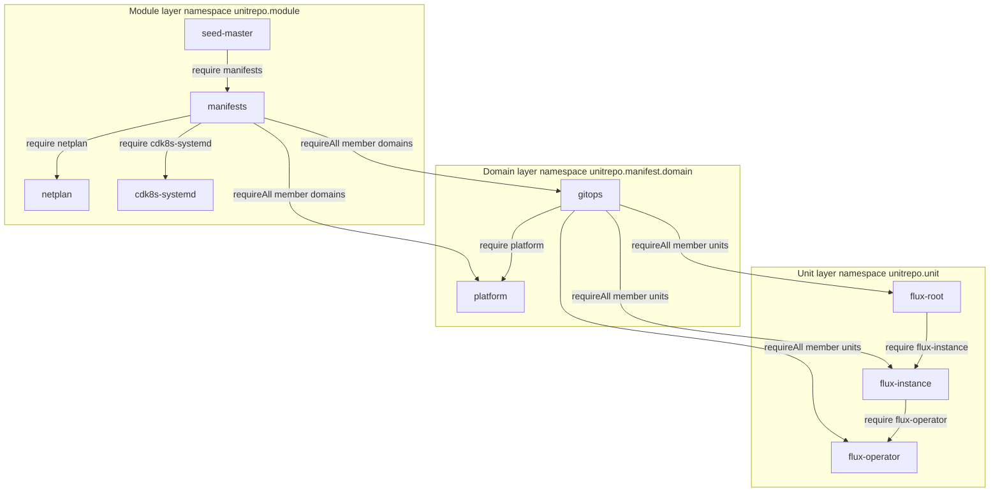
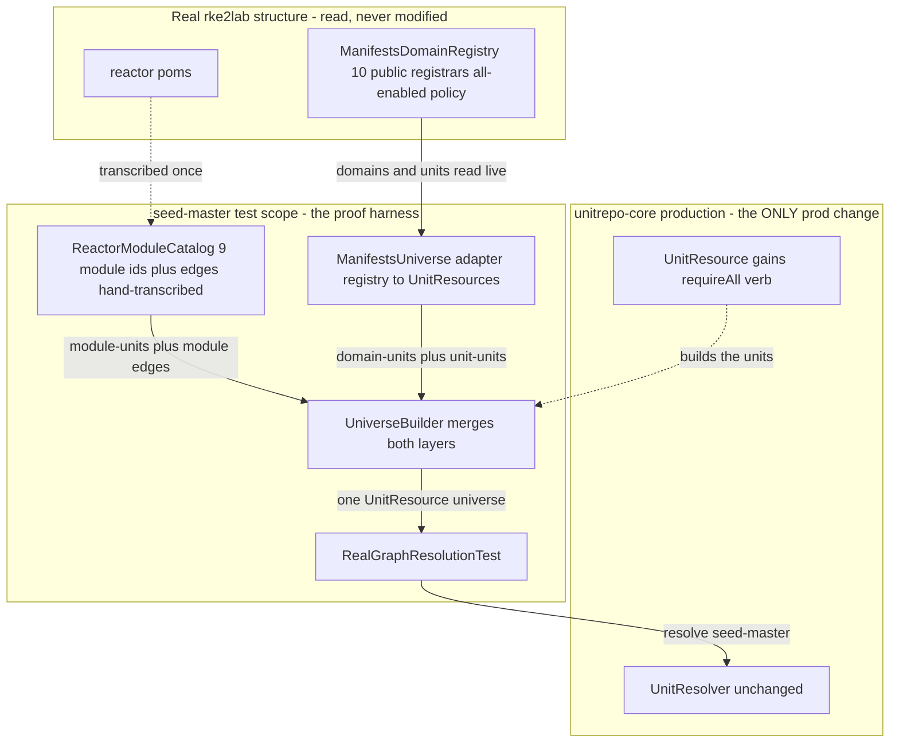
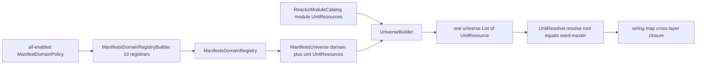

# Unitrepo resolution over the real rke2lab graph — design

**Date:** 2026-06-15
**Branch:** `feature/unitrepo-resolution-core` (extends commit `d13961ea`)
**Status:** design approved, ready for writing-plans

## 1. Goal & scope

Prove the just-shipped Felix-standalone resolver (`UnitResolver`, `unitrepo-core`)
computes the **real** rke2lab dependency closure — across two granularities in a
**single** `resolve()` pass — replacing the synthetic fixtures in
`UnitResolverTest` with structure read from the actual codebase. This validates
that `UnitResolver` genuinely subsumes the hand-rolled
`ManifestsUnitDependencyApplier` before anything further is built on it.

### In scope

- **One** generic addition to `unitrepo-core` production code: a `requireAll(ns,
  filter)` verb on `UnitResource` that sets the OSGi `cardinality:=multiple`
  directive, so the resolver wires *every* matching provider (not just one).
- A proof harness in **seed-master test scope** that builds a layered universe
  from real structure and runs one resolve.

### Out of scope (deferred, spec-faithful)

- Retiring `ManifestsUnitDependencyApplier` — that is migration step 3, owned by
  the migration plan, not this proof.
- Any framework, classloading, bnd headers, or `Provide-Capability` manifests —
  v2 loading track.
- Modifying the 28 unit / 10 domain / 11 registrar classes — V1 is **latent**;
  the harness *reads* their structure, never annotates them.

### Success criterion

A green, surefire-counted test in seed-master where one `resolve()` from the
`seed-master` module-unit returns a closure that provably spans all three layers,
including the load-bearing assertion that a `cardinality:=multiple` requirement
fanned out to more than one provider, plus an unsatisfiable-throws case.

## 2. The capability model

One universe, one `resolve()`, two granularities. Every edge is a *re-expression*
of structure already in rke2lab — nothing invented. The slice below is the real
*gitops* path, the cleanest exemplar because it exercises all five edge kinds.

**The crux: membership runs child to parent.** A contained unit *advertises* its
parent as an extra attribute on its own identity capability; the parent declares
one requirement with multiple cardinality matching all members. `manifests` says
"give me every domain whose `module=manifests`" exactly once, and the resolver
fans it out to all ten.

### The five edge kinds and their real source

| Edge | Verb on the requirer | Real source in the codebase |
|---|---|---|
| Module to module | `require`, filter on module id | Maven `<dependency>` between reactor modules (manifests needs netplan + cdk8s-systemd; seed-master needs manifests, netplan, systemd-contract, ...) |
| Module to its domains | `requireAll`, filter on `module=manifests` | Containment: all ten domains live inside the manifests module. Each domain advertises `module=manifests`. |
| Domain to domain | `require`, filter on domain id | `ManifestsDomain.dependsOnDomainIds()` — gitops→platform; runtime→cluster+platform. |
| Domain to its units | `requireAll`, filter on `domain=gitops` | Containment: `ManifestsDomain.units()`. Each unit advertises its domain id. |
| Unit to unit | `require`, filter on unit id | `ManifestsUnit.dependsOnManifestsUnitIds()` — flux-root→flux-instance→flux-operator (a real 3-deep chain). |

### What each unit provides

| Layer | Capability it provides |
|---|---|
| Module-unit | namespace `unitrepo.module`, attribute `module = <id>` |
| Domain-unit | namespace `unitrepo.manifest.domain`, attributes `domain = <id>` AND `module = manifests` (the membership marker the module matches) |
| Manifest-unit | namespace `unitrepo.unit`, attributes `unit = <id>` AND `domain = <its domain>` (the membership marker the domain matches) |

Membership is an *extra attribute* on the unit's own identity capability — no
separate "is-contained-in" namespace. That is what lets one `requireAll` on the
parent gather every child.

### The one production change this forces

`UnitResource.require(ns, filter)` today sets only the `filter:` directive, so
Felix wires a single provider per requirement. The two `requireAll` edges need
`cardinality:=multiple` (OSGi `Namespace.CARDINALITY_DIRECTIVE`).
`UnitResolver.findProviders` already returns *all* matches, so the only addition
to `unitrepo-core` is a sibling verb `requireAll(ns, filter)` that sets that
directive. Generic model vocabulary, not rke2lab-specific.

## 3. Components

Option A (decided): a hand-transcribed `ReactorModuleCatalog` for the coarse
layer; a `ManifestsUniverse` adapter reading the real registry for the fine
layer; both feed one universe. Everything rke2lab-specific is in seed-master
**test scope**; the only production change is the generic `requireAll` verb.

| Component | Where | Responsibility |
|---|---|---|
| `requireAll(ns, filter)` | unitrepo-core (prod) | Add a requirement with `cardinality:=multiple` so the resolver wires every match. The sole production change. |
| `ReactorModuleCatalog` | seed-master test | Name the 9 reactor modules and their module-to-module edges, transcribed from the poms (same pattern as `ManifestDomainCatalog`). Emits module-layer `UnitResource`s. |
| `ManifestsUniverse` | seed-master test | Adapter. Reads the real `ManifestsDomainRegistry`; emits domain- and unit-layer `UnitResource`s with membership attributes and the real depends-on edges. |
| `UniverseBuilder` | seed-master test | Merge both layers into one `List<UnitResource>` — the single universe handed to `UnitResolver`. |
| `RealGraphResolutionTest` | seed-master test | Resolve from the seed-master module-unit; assert the cross-layer closure and the unsatisfiable-throws case. |

### Grounded construction facts

- The 10 concrete domain registrars are **public** — the test builds the real
  registry via the public `ManifestsDomainRegistryBuilder` + the 10
  `*DomainRegistrar` classes (the 11th file is the `ManifestsDomainRegistrar`
  interface); no need to reach the package-private
  `DefaultManifestSynthesisService.buildDomainRegistry`.
- An all-enabled `ManifestDomainPolicy` comes from `enableOnly(catalog.all())`
  (the builder starts all-disabled via `resetAllDisabled()`).
- `ManifestsDomainRegistry` exposes `domains()` and `manifestUnits()` for reading.

### Placement rationale (forced, not chosen)

The cross-layer universe needs both the manifests registry and reactor-module
knowledge. `unitrepo-core` sits *below* manifests (cannot depend on it); only
`seed-master` depends on both. So the cross-layer proof lives in **seed-master
test scope** — which also matches the V1 spec's "seed-master *is* the level-0
node."

## 4. Data flow

`resolve(seed-master)` cascades: the module edge pulls `manifests`, its
`requireAll` pulls all domains, domain-to-domain wires order (gitops needs
platform), each domain's `requireAll` pulls its units, and unit-to-unit wires
order (the flux chain). A single pass returns the whole cross-layer closure — the
result `ManifestsUnitDependencyApplier` produces today, now computed by the
standalone Felix resolver over the real graph.

## 5. Testing (this is the deliverable)

A single seed-master test, `RealGraphResolutionTest`, JUnit + **surefire-counted**
(per build-verification discipline: count the surefire report, never trust BUILD
SUCCESS). Same shape as the existing `UnitResolverTest`: one happy-path, one
failure.

### Test 1 — `resolvesRealCrossLayerClosureFromSeedMaster`

1. Build all-enabled `ManifestDomainPolicy` (`enableOnly(catalog.all())`);
   assemble the real `ManifestsDomainRegistry` via the public builder + 10
   concrete registrars.
2. `ManifestsUniverse` emits domain-units (10) + manifest-units (28), each with
   membership attributes and real `dependsOnDomainIds` / `dependsOnManifestsUnitIds`
   edges. `ReactorModuleCatalog` emits 9 module-units + Maven edges.
3. `UniverseBuilder` merges into one universe. `resolve(seed-master)`.
4. Assert **kind coverage + landmark edges** (not an exact node count — brittle as
   units evolve):
   - closure contains `seed-master`, `manifests`, `netplan`, `cdk8s-systemd`
     (module layer reached);
   - contains at least one domain-unit pulled by the `manifests` `requireAll`
     membership edge (e.g. `gitops`);
   - contains the `gitops → platform` domain-to-domain wire (real
     `dependsOnDomainIds`);
   - contains the real unit-to-unit chain `flux-root → flux-instance →
     flux-operator` fully (the cascade reached leaves);
   - **the `gitops` `requireAll` wired more than one unit** — the load-bearing
     assertion proving `cardinality:=multiple` actually fanned out.

### Test 2 — `unsatisfiableCrossLayerRequirementThrows`

A module-unit requiring a domain nobody provides →
`assertThrows(ResolutionException.class, …)`. Same errors-as-values guarantee as
`UnitResolverTest`, at cross-layer scale.

### Deliberately not asserted

- Exact closure size (brittle).
- Anything about load/apply — V1 is resolution-only; loading is the deferred
  track.

### Anti-cheat

The `cardinality:=multiple` fan-out assertion (more than one unit wired) is the
one that fails loudly if `requireAll` is stubbed or the membership attributes are
wrong. It proves the design's crux, not merely that *something* resolved.

## Relationship to the larger arc

- This is the **resolution track**, framework-free — zero exposure to the v2
  framework-move/spike.
- It does **not** retire the walker; that is migration step 3 (the migration
  plan's call).
- The chosen membership + cardinality model is the OSGi-native expression of the
  containment already implicit in `ManifestsDomain.units()` and the reactor module
  tree — re-expression, not invention, consistent with the unitrepo thesis that
  V1 reads structure already there.
