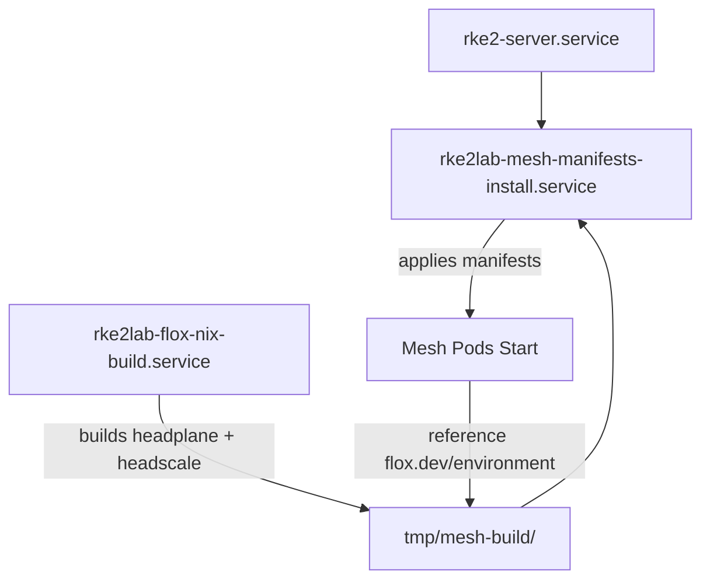

# Flox Environment Usage Inventory (@codebase)

## Current Usage

| Environment | Package | Location | Deployments | Build Status |
|---|---|---|---|---|
| `nxmatic/headplane` | headplane | [rke2.d/bioskop/master/catalog/mesh/headplane/](rke2.d/bioskop/master/catalog/mesh/headplane/) | Deployment, Job (agent-sync) | ✅ Building locally (rke2lab-flox-nix-build.service) |
| `nxmatic/headscale` | headscale | [rke2.d/bioskop/master/catalog/mesh/headscale/](rke2.d/bioskop/master/catalog/mesh/headscale/) | Deployment, Daemonset, Job (bootstrap) | ✅ Building locally (rke2lab-flox-nix-build.service) |

## Flake Sources

### Headplane Flake
```
rke2.d/bioskop/master/catalog/mesh/headplane/flake.nix
├── Upstream: github:tale/headplane
├── Provides: headplane, headplane-agent, headplane-ssh-wasm, headplane-nixos-docs
└── Also provides: headscale (from headplane overlay)
```

### Headscale Flake (Inline)
```
rke2.d/bioskop/master/catalog/mesh/headscale/
├── No dedicated flake.nix
├── Uses: headplane's flake (headscale is in the overlay)
└── Alternative: Could create dedicated flake from github:juanfont/headscale
```

## Pod to Environment Mapping

### Headplane
- **Deployment** (`headplane`)
  - Annotation: `flox.dev/environment: nxmatic/headplane`
  - Image: Base Alpine container with Flox runtime
  
- **Job** (`headplane-agent-sync`)
  - Annotation: `flox.dev/environment: nxmatic/headplane`
  - Purpose: Initialize configuration secrets
  - Image: Alpine + kubectl + yq via Flox

### Headscale  
- **Deployment** (`headscale`)
  - Annotation: `flox.dev/environment: nxmatic/headscale`
  - Image: Alpine with Flox runtime
  
- **Daemonset** (`headscale-client`)
  - Annotation: `flox.dev/environment: nxmatic/headscale`
  - Runs on all nodes as VPN client
  
- **Job** (`headscale-bootstrap`)
  - Annotation: `flox.dev/environment: nxmatic/headscale`
  - Purpose: Initial server setup
  - Image: Alpine + kubernetes tools via Flox
  
- **Deployment** (`headscale-gateway`)
  - Annotation: `flox.dev/environment: nxmatic/headscale`
  - VPN gateway pod

## Build Service Dependencies



## Configuration Points

### Setters (Customizable via kpt)

**Headplane** → [setters.yaml](rke2.d/bioskop/master/catalog/mesh/headplane/setters.yaml)
```yaml
headplane-flox-env: nxmatic/headplane    # Change to different flox env
headplane-base-url: http://...
headplane-cookie-secure: "true"
```

**Headscale** → [setters.yaml](rke2.d/bioskop/master/catalog/mesh/headscale/setters.yaml)
```yaml
headscale-flox-env: nxmatic/headscale    # Change to different flox env
headscale-version: "0.27.0"
headscale-namespace: headscale-system
```

## Build Outputs

When `rke2lab-flox-nix-build.service` runs:

```
/tmp/mesh-build/
├── headplane -> /nix/store/.../headplane-0.6.1
├── headplane-agent -> /nix/store/.../headplane-agent-0.6.1  
└── headscale -> /nix/store/.../headscale-0.27.0
```

Available to pod annotations via the Flox containerd shim:
- Pod reads `flox.dev/environment: nxmatic/headplane`
- Shim looks for this in: local Nix store → Flox Hub → fails

## Scalability Notes

### Multiple Clusters
If deploying to multiple clusters (bioskop, alcide):
- Same flake can be used (it's architecture-agnostic)
- Each node needs its own build phase
- Consider sharing via cachix.org or local registry

### Alternative Approaches

1. **Registry Push** (instead of local Flox env)
   - Build once, push to OCI registry (e.g., localhost:5000)
   - Update pod images to reference registry
   - Benefits: Build once, deploy everywhere
   - Trade-off: More infrastructure, less Flox-native

2. **Cachix** (for faster rebuilds)
   - Push store paths to `nxmatic.cachix.org`
   - Pull on each node instead of building
   - Benefits: Reduces build time, supports binary caching
   - Trade-off: Requires Cachix account, network dependency

3. **Commit to NixOS** (long-term)
   - Contribute headplane/headscale to nixpkgs
   - Available by default in all NixOS systems
   - Time investment but most scalable

## Next Steps

1. ✅ Git dir mounted in Incus config
2. ✅ Build service created (rke2lab-flox-nix-build.service)
3. ✅ Mesh install service updated (independent of build)
4. ⏳ Test build on next master restart
5. ⏳ Monitor logs for any issues
6. 📋 Consider cachix or registry for multi-cluster scenarios
